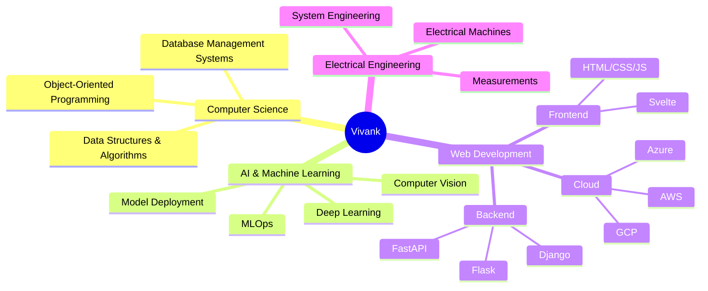

<div align="center">


[](https://github.com/Vivank411)
[](mailto:thevivank06@gmail.com)
[](#)

</div>

---

<div align="center">

## ⚡ POWER STATS ⚡

</div>

```ascii
╔══════════════════════════════════════════════════════════════╗
║  🎓 HERO CLASS: Electrical Engineering Student               ║
║  🎯 MAIN QUEST: Mastering AI/ML & Full-Stack Development     ║
║  ⚔️  SPECIAL ABILITY: Turning Ideas Into Reality             ║
║  🌟 ALIGNMENT: Chaotic Good (Problem Solver)                 ║
╚══════════════════════════════════════════════════════════════╝
```

<div align="center">

### 🎮 CURRENT MISSIONS

</div>

```javascript
const Vivank = {
    location: "Agra, India 🇮🇳",
    role: "Engineering Student & Developer",
    currentFocus: [
        "🧠 Mastering Core CS & OOP Concepts",
        "🤖 Building AI/ML Magic with Python",
        "🌐 Creating Full-Stack Web Applications",
        "⚡ Hardware-Software Integration Projects"
    ],
    lifeGoal: "Build technology that actually makes a difference 🚀",
    funFact: "I debug code like Tony Stark fixes his suits ⚙️"
};
```

---

<div align="center">

## 🛠️ ARSENAL | TECH STACK 🛠️

### ⚔️ LANGUAGES & FRAMEWORKS


### 🎯 WEB DEVELOPMENT


### 🤖 AI/ML WEAPONS


### ☁️ CLOUD & DEPLOYMENT


### 💾 DATABASE SYSTEMS


### 🛠️ TOOLS & UTILITIES


</div>

---

<div align="center">

## 🚀 LEGENDARY PROJECTS 🚀

</div>

<table align="center">
<tr>
<td width="50%" valign="top">

### 🛰️ GeoVision AI
**Satellite Intelligence System**

```python
mission = {
    "objective": "Satellite Image Analysis",
    "features": [
        "🗺️ Feature Detection",
        "📊 Change Analysis",
        "🎯 Geospatial Intelligence"
    ],
    "status": "OPERATIONAL"
}
```

**Tech:** Python • TensorFlow • OpenCV • Geospatial Analysis

</td>
<td width="50%" valign="top">

### ☁️ CloudCast-AI
**Weather Prediction Engine**

```python
mission = {
    "objective": "Cloud Motion Prediction",
    "features": [
        "🌤️ Diffusion Models",
        "🔮 Weather Forecasting",
        "🧠 Deep Learning"
    ],
    "status": "ACTIVE"
}
```

**Tech:** Python • PyTorch • ML Algorithms • Computer Vision

</td>
</tr>
<tr>
<td width="50%" valign="top">

### 🏥 Telemedicine App
**Healthcare Revolution**

```python
mission = {
    "objective": "Medical Access Platform",
    "features": [
        "📱 Low-Bandwidth Support",
        "👨‍⚕️ Remote Consultation",
        "🌍 Rural Healthcare"
    ],
    "status": "DEPLOYED"
}
```

**Tech:** Django • FastAPI • WebRTC • SQLite

</td>
<td width="50%" valign="top">

### 🎯 Coming Soon...
**The Next Big Thing**

```python
mission = {
    "objective": "???",
    "features": [
        "🔥 Revolutionary",
        "⚡ Game-Changing",
        "🚀 Mind-Blowing"
    ],
    "status": "IN_DEVELOPMENT"
}
```

**Stay Tuned!** 👀

</td>
</tr>
</table>

---

<div align="center">

## 📊 BATTLE STATISTICS 📊


</div>

---

<div align="center">

## 🎯 SKILL TREE 🎯

</div>



---

<div align="center">

## 🌟 CURRENT QUESTS 🌟

</div>

<table align="center">
<tr>
<td>

**🧠 KNOWLEDGE EXPANSION**
- [ ] Master Advanced Data Structures & Algorithms
- [ ] Deep Dive into System Design
- [ ] Advance ML Model Optimization
- [ ] Explore Distributed Systems

</td>
<td>

**💼 CAREER MISSIONS**
- [ ] Contribute to Major Open-Source Projects
- [ ] Build Portfolio-Worthy AI Applications
- [ ] Crack FAANG Interviews
- [ ] Publish Research Papers

</td>
</tr>
<tr>
<td>

**🚀 PROJECT GOALS**
- [ ] Launch Educational AI Platform
- [ ] Build Real-Time Collaboration Tools
- [ ] Create IoT + ML Integration Projects
- [ ] Develop SaaS Product

</td>
<td>

**🌱 PERSONAL GROWTH**
- [ ] Master Problem-Solving Patterns
- [ ] Enhance Communication Skills
- [ ] Build Technical Writing Portfolio
- [ ] Mentor Junior Developers

</td>
</tr>
</table>

---

<div align="center">

## 💭 PHILOSOPHY 💭

</div>

<div align="center">

> *"With great code comes great responsibility"* 🕷️  
> *"I am inevitable... with my debugging skills"* 💎  
> *"Just one more commit..."* ⚡  

</div>

```python
class EngineerPhilosophy:
    def __init__(self):
        self.motto = "Build solutions, not just code"
        self.approach = "Think like Tony Stark, debug like Peter Parker"
        self.goal = "Make technology accessible to everyone"
    
    def daily_mantra(self):
        return "Code. Build. Ship. Repeat. 🚀"
    
    def handle_bugs(self):
        return "Every bug is a feature in disguise 🐛✨"
```

---

<div align="center">

## 🤝 LET'S CONNECT & COLLABORATE! 🤝


[](https://github.com/Vivank411)
[](mailto:thevivank06@gmail.com)
[](#)
[](#)

### 💬 Open for:
`Collaborations` • `Open Source` • `Internships` • `Freelance Projects` • `Tech Discussions`

</div>

---

<div align="center">

## 🎮 PLAY SNAKE GAME! 🎮

### 🐍 Classic Snake Game 🐍

<div align="center">

</div>

</div>

---

<div align="center">

### ⚡ *"Innovating one line of code at a time"* ⚡


</div>

---

<div align="center">

```ascii
╔═══════════════════════════════════════════════════════════╗
║                                                           ║
║   "The best way to predict the future is to build it"    ║
║                                                           ║
║                    - Keep Coding! -                       ║
║                                                           ║
╚═══════════════════════════════════════════════════════════╝
```

**⭐ Star my repos if you find them interesting!**  
**🔔 Follow for more awesome projects!**

</div>
